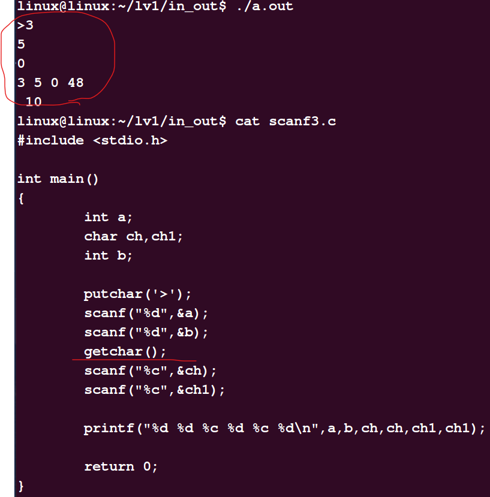
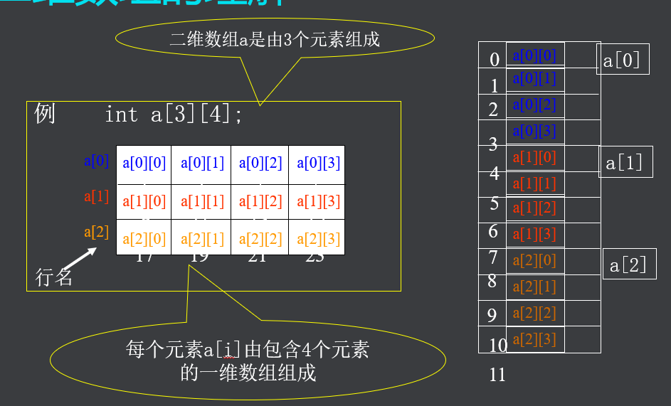
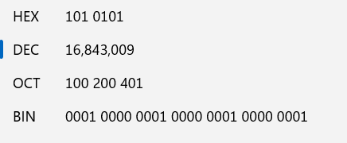
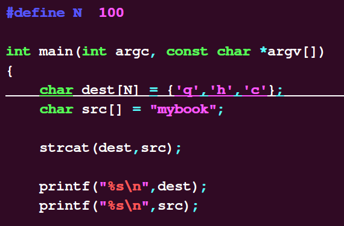
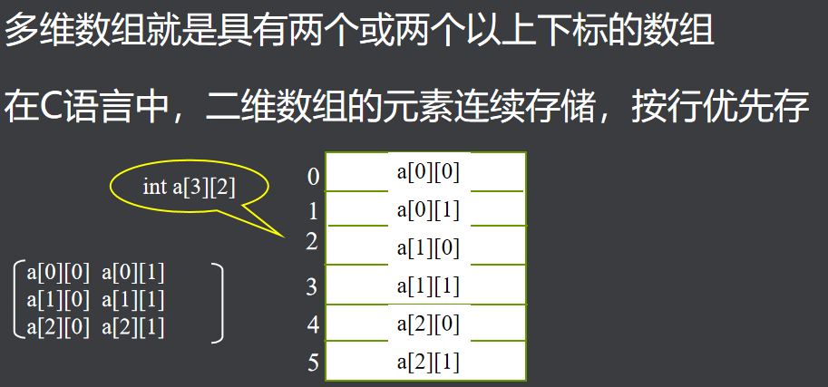
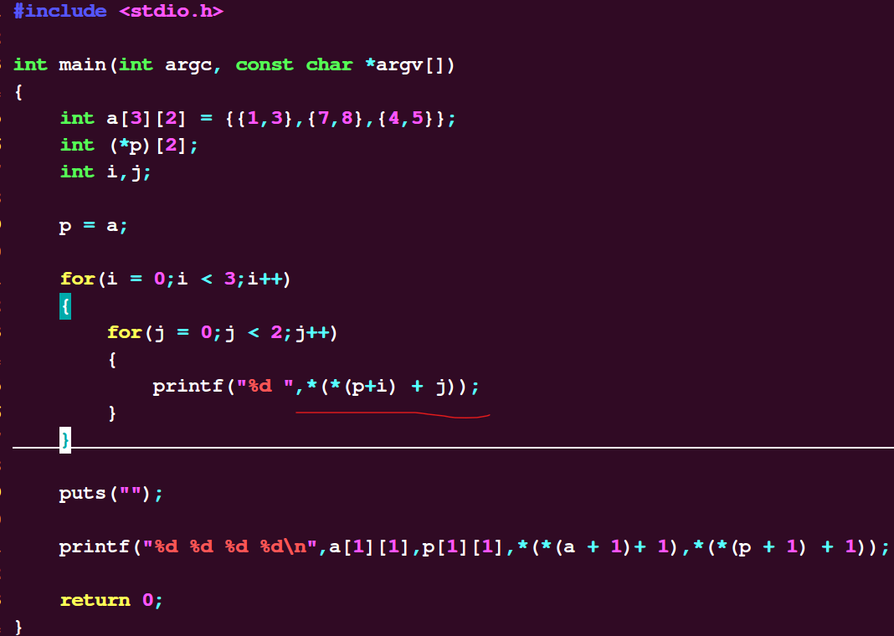
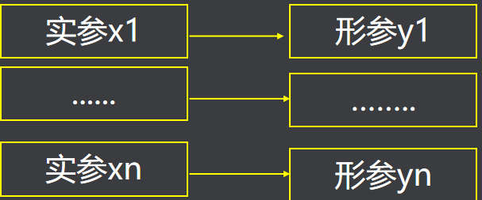

# 必备Linux命令和C语言基础：


文件和目录相关命令：

ls [OPTION]... [FILE]...


ls -a  不忽略那些以点开头的文件

ls -l   显示长格式

ls -R  子目录递归显示


权限：用户（创建者   同组用户  其他用户）


cat -s  空行合并显示

cat  -b 加行号显示


nl  加行号

head -n  显示头部n行（默认显示10行）

tail   -n   显示尾部n行（默认也是10行）

ctrl shift +t再开一个标签

ctrl shift +n再开一个窗口


cp  复制


mv  file1  file2   重命名

mv   file1  路径   移动到指定路径下

mv   file1  路径  file2  移动并重命名


touch 创建或更改时间戳

rm  -i  删除文件  与用户交互

rm  -r  directory  删除文件夹


mkdir  -p 级联创建


: ! command

:w  File 另存为File给出的文件名，不退出   类似于回到终端cp重命名成另一个文件名


__FILE__,__FUNCTION__,__LINE__分别表示文件名，函数名，行号，如下图所示


计算机基本结构：


输入设备、输出设备、cpu（控制器、运算器）、存储器


存储器分类：


主存储器即内存，程序中待处理的数据和处理的结果都存储在内存中

外存储器是用来长期保存数据的大容量存储器

寄存器是cpu内部的高速存储器


------


# 数据类型、常量变量及运算符


数据类型


简图：


基本数据类型中也额外包含布尔类型（c99标准新加的），基本数据布尔类型为： _Bool   

定义bool变量需要引入头文件<stdbool.h>,在它里面，有#define bool _Bool这样的宏定义，而_Bool又是基本类型，可以被编译器所接受


字符类型：

char 占一个字节


unsigned char   数据范围：0-255

signed char       数据范围：-128-127


-1      原码：1000  0001

​          反码： 1111 1110  

​          补码： 1111 1111


-127   原码：1111 1111

​          反码：1000  0000

​          补码： 1000 0001

可见-1的原码是-127的补码，-127的原码是-1的补码


另外-128的补码为1111 1111

计算机以补码的形式存放数据


int  32位机占4个字节


查看数据类型数据范围在limit.h中查看（vi /usr/include/limits.h）


常量：


八进制前缀0，例如：0423

十六进制前缀0x 例如0xfe;


字符常量：


大写字母与小写字母ASCII码值相差32，字符数字与整型数字相差48


字符串常量：


所谓字符串常量是指用双引号引起来的一串字符来表示的数据（字符串以\0结尾）


比如："8" 就相当于  {'8' ,'\0'}


标识常量：


比如  #define   GPIOA   0xxxxxx


define宏定义是在预处理时进行的简单的替换与宏展开，一般为了防止出现无法预料的结果，我们一般在能加括弧的地方尽量都加上括弧。         不加括弧的实例：


源码:


```c
#include <stdio.h>


#define ONE 1 + 1

#define TWO ONE + ONE


int main()

{

​    int a,b,c;


​    a = 10;

​    b = 11;


​    c = ONE*a + TWO*b + 1;


​    printf("%d\n",c);


​    return 0;

}
```


------

变量

变量在使用时必须预先说明其存储类型和数据类型


变量基础：

变量在程序中用变量名表示。变量名由用户根据其用途任意命名。

变量名由字母、数字、下划线组成，不能以数字开头，不能和C的关键字重名。

在程序运行时，变量占据存储空间的大小由其数据类型决定。

变量在内存空间中的首地址，称为变量的地址。


变量的说明：


1.auto说明的变量：

auto说明的变量只能在某个程序范围内使用，通常在函数体内或函数中的复合语句里。（默认是随机值）

在函数体的某程序段内说明auto存储类型的变量时可以省略关键字auto，如下：

\*    auto int  k ;    

\*    int  j ;      

\*    double x;      


例如以下程序：


① ：只能在某一程序范围内使用，除了这个范围内存立即被销毁

② ：默认是随机值


2.register:


一般而言，如果将数据放到内存里面，这样每次处理器访问数据的话都要通过32根地址线去访问数据，处理起来比较耗时，效率不高，当然可以将内存里的数据直接放到缓存里，但是效率也不如直接放到cpu里的寄存器里的高。


但是，当寄存器的数量是有限的，另外也只能存放与机器位数相符的数据，比如32位机寄存器只能存放小于4个字节的数据，如果不能存放大量的数据来满足用户需求的话，这是就使用一般内存，比如上面所述的auto


另外地址是相对于内存而言的，register没有地址，不可对其取地址（&）


而且并不是所有的寄存器都可以用来存放数据


由于寄存器的数量有限，真正起作用的register修饰符的数目和类型都依赖于运行程序的机器。

在某些情况下，把变量保存在寄存器中反而会降低程序的运行速度。因为被占用的寄存器不能再用于其它目的；或者变量被使用的次数不够多，不足以装入和存储变量所带来的额外开销


3.static与extern：


static变量称为静态存储类型的变量，既可以在函数体内，也可在函数体外说明。(默认是0）

局部变量使用static修饰,有以下特点:

\* 在内存中以固定地址存放的，而不是以堆栈方式存放

\* 只要程序没结束，就不会随着说明它的程序段的结束而消失，它下次再调用该函数，该存储类型的变量不再重新说明，而且还保留上次调用存入的数值。


static修饰的局部变量：


```c
#include <stdio.h>


int main()

{

​    int i = 1;


​    while(i < 5)

​    {

//    int a = 0;

​      static int a;

​      a++;

​      printf("a=%d\n",a);

​      i++;

​    }

​    return 0;

}
```


程序运行结果：

linux@linux:~/lv1/variable$ ./a.out

a=1

a=2

a=3

a=4

可见

1.static修饰的局部变量的默认值为0

2.由static修饰的局部变量的生存期被延长，程序不结束变量的内存不被销毁，不是像局部变量一样以堆栈的形式存放，而且被调用时还会记录保留上次的值。


static修饰的全局变量

禁止被其他文件使用


extern修饰的全局变量：


当变量在一个文件中的函数体外说明，所有其他文件中的函数或程序段都可引用这个变量。（全局变量）


extern称为外部参照引用型，使用extern说明的变量是想引用在其它文件中函数体外部说明的变量。


代码及运行结果：

注意：对于extern声明引用的的变量，在编译时要将有关文件一起编译


或者使局部变量全局化


**static修饰的全局变量**


static修饰的全局变量，其它文件无法使用


auto与static对比总结


修饰局部变量时：

不同点一：不使用static关键字声明的局部变量默认值是随机的，而使用static 关键字修饰的局部变量默认值为0

不同点二：不使用static关键字声明的局部变量在函数段内执行时，它的值是不断进行空间销毁和重新赋值的。  而使用static修饰的局部变量在内存中以固定地址存放，程序结束前值不会被销毁。

 

static可以修饰局部变量也可以修饰全局变量，而auto只能修饰局部变量，不能修饰全局变量，而且全局变量默认为extern存储类型


const和define的区别


------

运算符：


算术运算符：


注意： a++：先取值后运算

​           ++a :  先运算后取值 


------


# 输入输出：


\* C语言无I/O语句，I/O操作由函数实现

​    \* #include <stdio.h>

\* 字符输出函数

​    \* 格式: putchar( c )   //参数视为ASCII码值处理

​    \* 参数: c为字符常量、变量或表达式

​    \* 功能：把字符c输出到显示器上

​    \* 返值：正常，为显示的代码值；


\* 格式：printf(“格式控制串”，输出表)

\* 功能：按指定格式向显示器输出数据

\* 输出表：要输出的数据

\* 格式控制串：包含两种信息

​    \* 格式说明：%[修饰符]格式字符，用于指定输出格式

​    \* 普通字符：原样输出


g,G格式符选用%f或%e格式中输出长度较短的一种格式，不输出无意义的0，用G时，若以指数形式输出，则指数以大写表示


%g是C语言printf()函数的一个输出格式类型，它表示以%f%e中较短的输出宽度输出单、双精度实数，在指数小于-4或者大于等于精度时使用%e格式

 printf()输出格式类型说明：

 输出类型 格式字符意义

 a        浮点数、十六进制数字和p-计数法(C99)

 A        浮点数、十六进制数字和p-计数法(C99)

 c 输出单个字符

 d 以十进制形式输出带符号整数(正数不输出符号)

 e 以指数形式输出单、双精度实数  指数标识为e

 E 以指数形式输出单、双精度实数  指数标识为E

 f 以小数形式输出单、双精度实数

 G       以%f%E中较短的输出宽度输出单、双精度实数，在指数小于-4或者大于等于精度时使用%E格式

 i         有符号十进制整数(与%d相同)

 o 以八进制形式输出无符号整数(不输出前缀O)

 p       输出内存地址形式数据（16进制）

 s 输出字符串

 x 以十六进制形式输出无符号整数(不输出前缀OX)

 X 以十六进制形式输出无符号整数(不输出前缀OX)

 u       以十进制形式输出无符号整数

 PS: 有关%g输出的补充说明

%g用于打印浮点型数据时，会去掉多余的零，至多保留六位有效数字（不同于%e的默认保留小数点后6位）

当%g用于打印超过6位的浮点型数据时，因为精度问题，%f不得不输出一个不精确的超过六位的数字，%e也是同样，而%g此时会选择%e格式进行输出，并且按第一条要求，去掉多余的零，并且四舍五入到6位数字。这是《C Primer Plus》中所说的超过精度的时候的情况。  （可见，这个6位，是按float类型精度来计算的。）

当一个数字的绝对值很小的时候，要表示这个数字所需要的字符数目就会多到让人难以接受。举例而言，如果我们把π*10^-10写作0.00000000000314159就会显得非常丑陋不雅，反之，如果我们写作3.14159e-10，就不但简洁而且易读好懂。当指数是-4时，这两种表现形式大小相同。对于比较小的数值，除非该数的指数小于或者等于-5，%g才会采用科学技术发来表示，即，以%e的格式进行输出。


附加格式输出：


m 与.n测试结果


格式输出字符串;


0和+输出


字符输入函数getchar

\* 格式:  getchar( )

\* 功能：从键盘读一字符

\* 返值：正常，返回读取的代码值；出错或结束键盘输入,返回-1 （ctrl   d）


getchar/putchar的返回值为什么用int型，怎么不用char型或者unsigned char型？


因为他们是按ASCII码输入和输出，而如果采用char型，范围是-128-127，而ASCII码范围是0-255，肯定不够；但是考虑到出错或者结束输入时的返回值-1也要容纳，故采用int型


getchar还可用于循环读入一串字符


格式: scanf(“格式控制串”，地址表）

\* 功能：按指定格式从键盘读入数据，存入地址表指定

\* 存储单元中,并按回车键结束

\* 返值：正常，返回输入数据个数

\* 地址表：变量的地址，常用取地址运算符&


注意：如果多于一个，默认用回车隔开


位宽输入：


抑制符*：


位宽输入时空格、回车、制表符均被视为分隔符，不会影响结果：


说明：

用“%c”格式符时，空格和转义字符作为有效字符输入

例子，

scanf(“%c%c%c”,&c1,&c2,&c3);

若输入abc  

则c1为a, c2为空格, c3为b


\* 总结，输入数据时，遇以下情况认为该数据结束：

​    \* 遇空格、TAB、或回车

​    \* 遇非法输入

​    \* 遇宽度结束


垃圾字符的处理：


方法1：

getchar()处理垃圾字符：





同时可以看到输入3,5之间的回车并不是垃圾字符，输入完5之后的回车是垃圾字符


可是有个问题：


第一次输入3，5的回车为什么不被当做垃圾字符？


方法2：


使用空格或者%*c吃掉垃圾字符：


linux@linux:~/lv1/in_out$ ./a.out

\>3

5

0

7

3 5 0 48 7 55

linux@linux:~/lv1/in_out$ cat scanf5.c


```c
#include <stdio.h>

int main()

{

​    int a;

​    char ch,ch1;

​    int b;


​    putchar('>');

​    scanf("%d",&a);

​    scanf("%d",&b);

//  getchar();

​    

//  scanf("%*c%c",&ch);

//  scanf("%*c%c",&ch1);

​    

​    scanf(" %c",&ch);

​    scanf(" %c",&ch1);


​    printf("%d %d %c %d %c %d\n",a,b,ch,ch,ch1,ch1);


​    return 0;

}
```


字符串输入函数:


gets函数

char *gets(char *s);


\* 功能：从键盘输入一以回车结束的字符串放入字符数组中，并自动加‘\0’

\* 说明1：输入串长度应小于字符数组维数

说明2：与scanf函数不同，gets函数并不以空格作为字符串输入结束的标志


使用gets输入字符串:


```shell
linux@linux:~/lv1/in_out$ gcc gets.c -Wall

gets.c: In function ‘main’:

gets.c:7:2: warning: ‘gets’ is deprecated (declared at /usr/include/stdio.h:638) [-Wdeprecated-declarations]

  gets(s);

  ^

/tmp/cc2JR3yM.o: In function `main':

gets.c:(.text+0x24): warning: the `gets' function is dangerous and should not be used.

linux@linux:~/lv1/in_out$ ./a.out

wqw

wqw

linux@linux:~/lv1/in_out$ ./a.out

tgret

tgret

linux@linux:~/lv1/in_out$ ./a.out

e3tfretruhyt

e3tfretruhyt

*** stack smashing detected ***: ./a.out terminated

Aborted (core dumped)

linux@linux:~/lv1/in_out$ vi gets.c

linux@linux:~/lv1/in_out$ cat gets.c

\#include <stdio.h>


int main(int argc, const char *argv[])

{

​    char s[5];


​    gets(s);

​    printf("%s\n",s);


​    return 0;

}
```


使用scanf输入字符串： 遇空格结束输入


```shell
linux@linux:~/lv1/in_out$ ./a.out

q er

q

linux@linux:~/lv1/in_out$ cat gets.c

\#include <stdio.h>


int main(int argc, const char *argv[])

{

​    char s[5];

//  char *s1 = NULL;


//  s1 = gets(s);

​    scanf("%s",s);

​    printf("%s\n",s);


​    return 0;

}


```

gets为什么是不安全的？


gets() 函数的形参只有一个指针。它会从标准输入流中读字符到一块连续的内存地址空间中。这块地址空间的开始位置就是指针 str 指向的位置。当在输入流中遇到文件结束符( EOF )或者换行符(n)时，读取操作结束。当读入换行符(n)时，该字符不会被放入那块连续的地址空间中。在读取结束时， gets() 会自动在内存空间的末尾追加一个 NULL 字符。经过上述这些操作，对于程序员来说，这个函数得到的就是从标准输入进来的，以 NULL 字符结尾的C字符串。如果读入的字符流是一整行的话，行尾的换行符将会被舍去。


[https://www.baidu.com/link?url=_wIhpF4DqxL-XusnbhI7vmFPA17hMGlPt6ke4XnPndRCkrf4Zp3B-](https://www.baidu.com/link?url=_wIhpF4DqxL-XusnbhI7vmFPA17hMGlPt6ke4XnPndRCkrf4Zp3B-lCD1U_Judip0O4f8OufGaf7gOi9kkaOBCZzxMUYia985IKmIGRlhfm&wd=&eqid=8c305d4f000687f40000000263845ba1)


字符串输出函数puts

\* 格式：int puts(const char *s)

\* 功能：向显示器输出字符串（输出完，换行）

\* 说明：字符数组必须以‘\0’结束


------


# 控制语句：


switch语句的基本形式

switch (表达式)

{  case 常量表达式1:语句块1；break;

   case 常量表达式2:语句块2; break;

​    ….

   case 常量表达式n:语句块n; break;

   default    :语句块n+1

  }


switch语句的使用：

\* 每个常量表达式的值必须各不相同,否则将会出现矛盾。

\* 当表达式的值与case后面的常量表达式值相等时，就执行此case后面的语句。

\* switch中的表达式可以是整型、字符型表达式或枚举。

\* case 常量：只起语句标号的作用。


switch语句的使用：

\* break语句用于强行跳出switch体，一般每个case后面应有一个break语句，default分支后的break可以省略。

\* 多个case可以执行一组语句。


当公用一个分支时，可以简化代码：


```c
#include <stdio.h>


int main(int argc, const char *argv[])

{

​    float score;


​    printf("please input your score:\n");

​    scanf("%f",&score);


​    if(!(score >= 0 && score <=100))
​    {
​        printf("invalid arguments\n");
​    }

​    else

​    {

​        switch((int)score/10)

​        {

​            case 10:


​            case 9:

​                printf("A-excellent\n");

​                break;


​            case 8:

​            case 7:

​                printf("B-good\n");

​                break;

​            case 6:

​                printf("C-OK\n");

​                break;


​            default :

​                printf("D-not pass\n");
​        }
​    }

​    return 0;

}
```


循环语句：


goto 加语句标号


但此方法有弊端，C语言中的goto，编译为汇编之后，会生成很多跳转指令，打断流水线，影响程序的执行效率


但是也有着显著的优点：


集中于一处退出：

循环结构程序

\* 当函数有很多个出口，使用goto把这些出口集中到一处是很方便的，特别是函数中有许多重复的清理工作的时候。（比如退出时内存的释放、文件描述符的关闭、套接字的关闭、数据库的关闭等）

\* 理由是：

\* -无条件跳转易于理解

\* -可以减少嵌套

\* -可以避免那种忘记更新某一个出口点的问题

\* -算是帮助编译器做了代码优化


go语句可以从多重循环中直接跳出，可以在出错时清除资源，可以增加程序的清晰度的情况，但即使如此，如果没有自问自己是否得到了正确使用它的方法，不加限制的使用会带来远超于利的弊端。


while循环：


while语句构成循环

\* 基本形式

\* 例子，求1到100的和

while (表达式） {

  statatments;

}


do-while语句构成循环

\* 基本形式

\* 例子，求1到100的和

do {

  statatments;

}while(表达式）；


while强调循环条件，do...while强调循环体


打印出所有的“水仙花”数。“水仙花”数是指一个3位数，其各个位数字立方和等于该数本身。


\#include <math.h>


​       double pow(double x, double y);

​       float powf(float x, float y);

​       long double powl(long double x, long double y);


​       Link with -lm.


# 数组：


数组

\* 构造数据类型之一

\* 数组是具有一定顺序关系的若干个变量的集合，组成数组的各个变量称为数组的元素

\* 数组中各元素的数据类型要求相同,用数组名和下标确定。数组可以是一维的，也可以是多维的。


一维数组的定义

\* 所谓一维数组是指只有一个下标的数组。它在计算机的内存中是连续存储的。

\* C语言中，一维数组的说明一般形式如下：

<存储类型>  <数据类型 >  <数组名>[<表达式>]


数组名表示内存首地址，是地址常量

sizof(数组名）是数组占用的总内存空间


编译时分配连续内存

内存字节数=数组维数*

​      sizeof(元素数据类型


验证数组元素的连续存储、数组名是整个数组的首地址且与第一个元素的地址相同、内存字节数=sizeof(数组名) = sizeof(数据类型*数组长度):


注意：


数组的元素个数需要在数组定义时就确定了，不能随着程序的运行而更改


如果引用数组元素时，下标越界，那结果是不可预料的


注意：数组名是地址常量，不能更改，数组元素是变量，可以更改


\* C语言对数组不作越界检查，使用时要注意

int a[5]; a[5] = 10


\* 关于用变量定义数组维数

int i = 15; int a[i]             //C89中不能在方括号中用变量定义个数，但是gcc可以


\* 数组必须先定义，后使用

\* 只能逐个引用数组元素，不能一次引用整个数组

\* 数组元素表示形式：数组名[下标]

​    \* 其中：下标可以是常量或整型表达式


**一维数组的初始化：**


\* 初始化方式：在定义数组时，为数组元素赋初值

​    \* int a[5]={1,2,3,4,5};

\* 说明

​    \* 数组不初始化，其元素值为随机数

​    \* 对static数组元素不赋初值，系统会自动赋以0值

​    \* 只给部分数组元素赋初值


给数组元素赋予全0的方式：


1.定义时存储类型为static

2.int a[10] = {};

3.int a[10] = {0};

4.或者逐个赋值


部分初始化：


int a[10] = {1,2,3}; //未被初始化的元素为0


全部初始化：


对元素逐个赋值


数组指定元素初始化：

1.int a[100] = {};

​    a[10] = 10;


**2.int a[100] = {[10] = 10};    //****强烈推荐**


**二维数组：**


**二维数组的定义**

*** 定义方式：（声明时****列数不能省略，行数可以****）**

*** 例int a[3][4];**

   **数据类型 数组名[常量表达式][常量表达式]；**

​     **float b[2][5];**

​     **int c[2][3][4];**


*** 数组元素的存放顺序**

​    *** 原因:内存是一维的**

​    *** 二维数组：****按行序优先**





*** 形式：数组名[下标][下标]**

*** 二维数组元素的初始化**

​    *** 分行初始化**

​    *** 按元素排列顺序初始化**


**空出的补0**


**二位数组举例：**


**打印杨辉三角的前十行**

**1**

**1   1**

**1   2   1**

**1   3   3   1**

**1   4   6   4   1**

**1   5   10  10  5   1**

**................**


```c
#include <stdio.h>

#include <string.h>


int main(int argc, const char *argv[])

{

​    int i,j;

​    int a[10][10] = {{1}};


​    for(i = 0;i < 10;i++)

​    {

​        for(j  = 0;j < 10;j++)

​        {

​            a[i][j] = 1;

​        }

​    }


​    for(i = 2;i < 10;i++)

​    {

​        for(j = 1;j < i;j++)

​        {

​            a[i][j] = a[i - 1][j - 1] + a[i - 1][j];

​        }

​    }


​    for(i = 0;i < 10;i++)

​    {

​        for(j = 0;j <= i;j++)

​        {

​            printf("%d ",a[i][j]);

​        }


​        puts("");

​    }

​    return 0;
}
```


**只能用动态赋值，下面是使用memset出现的问题：**


**将数组int a[10][10] = {{}};使用memset全部赋值为1，但是结果出现问题：**





**memset是按字节赋值的**

**memset用法：**

**按字节赋值：**


int num[8];

​       我们用memset给str初始化为{1,1,1,1,1,1,1,1}，

​       memset(num,1,8);//这样是不对的

​     一个int是4个字节的，8个int是32个字节，所以首先要赋值的长度就不应该为8而是32。

​     因为memset是 逐字节 拷贝，以num为首地址的8字节空间都被赋值为1，

​     即一个int变为0X00000001 00000001 00000001 00000001，显然，把这个数化为十进制不会等于1的。

​     所以，在memset使用时要千万小心，在给char以外的数组赋值时，只能初始化为0或者-1。因为在计算机里，0的二进制都是0，-1的二进制都是1。

​     最近才发现memset的这个问题，而我当时却不知memset有这个问题，特此记下，引以为鉴。


# 字符数组与字符串：


字符数组是元素的数据类型为字符类型的数组

\* char c[10], ch[3][4];


字符数组的初始化

\* 逐个字符赋值

\* 用字符串常量


**C语言中无字符串变量，用字符数组处理字符串**

**字符串结束标志：‘\0’**


观察下面程序;


输出结果为：


于是我猜测这两个字符数组在内存中的空间是连续的


下面开始验证：


将程序改为如下，试图打印地址来验证猜想：


但结果如下：


观察到打印的qhc后面的字符出现乱码，并且‘q’，‘h’，‘c’三个字符打印完，c的地址与乱码字符的首地址相差8个字节，所以进一步猜想可能是定义的n,i在两个字符数组间插队了，进一步验证


输出结果如下：


 可见确实是新定义的n,i插队了。印证了一句话，如果引用的数组元素的下标越界，那结果将是不可预料的


字符串函数：


1.strlen


size_t strlen(const char *s);


字符串长度函数strlen

\* 格式：strlen(字符数组)

\* 功能：计算字符串长度

\* 返值：返回字符串实际长度，不包括‘\0’在内

\* \xhh表示十六进制数代表的符号

\* \ddd表示8进制的

\* 例：对于以下字符串，strlen(s)的值为：

char  s[10]={‘A’,‘\0’,‘B’,‘C’,‘\0’,‘D’};

char  s[ ]=“\t\v\\\0will\n”;

char  s[ ]=“\x69\141\n”;

答案：1   3   3


遇到\0截止，以\开头的均为转义字符，转义字符加上\算一个字符，\xhh代表16进制字符，\ddd代表8进制字符


结果为7、8      3、4


2.strcpy


char *strcpy(char *dest, const char *src);


字符串拷贝函数strcpy

\* 格式：strcpy(字符数组1,字符串2)

\* 功能：将字符串2，拷贝到字符数组1中去

\* 返值：返回字符数组1的首地址

\* 说明：

字符数组1必须足够大

拷贝时‘\0’一同拷贝


The  strcpy()  function  copies the string pointed to by src, including

​       the terminating null byte ('\0'), to the buffer  pointed  to  by  dest.

​       The  strings  may  not overlap, and the destination string dest must be

​       large enough to receive the copy.  Beware  of  buffer  overruns!   (See

​       BUGS.)


3.strcat


char *strcat(char *dest, const char *src);


​       The  strcat() function appends the src string to the dest string, over‐

​       writing the terminating null byte ('\0') at the end of dest,  and  then

​       adds  a  terminating  null  byte.  The strings may not overlap, and the

​       dest string must have enough space for the  result.   If  dest  is  not

​       large  enough, program behavior is unpredictable; buffer overruns are a

​       favorite avenue for attacking secure programs.

   如果dest不是足够大，程序行为是不可预测的; 缓冲区溢出是一个攻击安全程序最喜欢的途径。

​       

​        

字符串连接函数strcat

\* 格式：strcat(字符数组1,字符数组2)

\* 功能：把字符数组2连到字符数组1后面

\* 返值：返回字符数组1的首地址

\* 说明：

​    字符数组1必须足够大

​    连接前,两串均以‘\0’结束;连接后,串1的 '\0’取消,新串最后加‘\0’


如果被连接的字符数组不是字符串（不含\0），那么连接的结果将是完全不可预料的


第一种情况：dest是以\0结束的字符数组，其实就是字符串，程序：





linux@linux:~/lv1/string$ ./a.out

qhcmybook

mybook


正常进行连接


第二种情况：


linux@linux:~/lv1/string$ ./a.out

qhcmybookmybookm

mybookmybookm


由于dest数组不以\0结束，即不是字符串，那么结果呈现出上述情况，下面进行分析：


打印地址做测试：


可见目标数组与原字符串地址是连续的，画图分析：


按照以上分析应该打印的是qhcmybookmybook,但是不理解为为什么最后多了一个m，反正记住访问数组元素时，超出数组范围（下标越界），此时dest没有足够的空间容纳连接的结果，因此结果将是不可预料的。main手册也提及到了


4.strcmp


字符串比较函数strcmp

\* 格       式：strcmp(字符串1,字符串2)

\* 功       能：比较两个字符串

​    \* 比较规则：对两串从左向右逐个字符比较 （ASCII码），直到遇到不同字符或‘\0’为止       

\* 返       值：返回int型整数

​                                                     

a. 若字符串1< 字符串2， 返回负整数

b. 若字符串1> 字符串2， 返回正整数

c. 若字符串1== 字符串2， 返回零


字符串函数拓展：


The  strchr() function returns a pointer to the first occurrence of the

​       character c in the string s.


​       The strrchr() function returns a pointer to the last occurrence of  the

​       character c in the string s.


另外扩展，toupper与tolower大小写转换函数


# 指针：


C程序设计中使用指针可以使程序简洁、紧凑、高效 有效地表示复杂的数据结构 动态分配内存 得到多于一个的函数返回值


在C语言中，内存单元的地址称为指针，专门用来存放地址的变量，称为指针变量在不影响理解的情况中，有时对地址、指针和指针变量不区分，通称指针


指针变量的说明一般形式如下： <存储类型>   <数据类型>   * <指针变量名> ; 例如，char  *pName ; 指针的存储类型是指针变量本身的存储类型。 指针说明时指定的数据类型不是指针变量本身的数据类型，而是指针目标的数据类型。简称为指针的数据类型


**指针的运算：**


指针运算是以指针变量所存放的地址量作为运算量而进行的运算

指针运算的实质就是地址的计算 

指针运算的种类是有限的，它只能进行赋值运算、算术运算和关系运算


不同数据类型的两个指针实行加减整数运算是无意义的

px+n表示的实际位置的地址量是： (px) + sizeof(px的类型) * n

px-n表示的实际位置的地址量是： (px) - sizeof(px的类型) * n


两指针相减运算px-py 运算的结果是两指针指向的地址位置之间相隔数据的个数

因.此，两指针相减不是两指针持有的地址值相减的结果。 

两指针相减的结果值不是地址量，而是一个整数值，表示两指针之间相隔数据的个数。


指针的移动本质是指针变量存放的地址值被改变，如图所示：（虚线代表原始位置，实线代表目前位置）


也就是说：

px++:（前置自增）

或++px:  (后置自增)     


px每加一，将会移动个目标数据，px指针变量存放的地址值会变化，对于int型，增量为4


相反，对于px--或--px来说：


px每减一，将会移动个目标数据，px指针变量存放的地址值会变化，对于int型，增量为-4


指针关系运算两指针之间的关系运算表示它们指向的地址位置之间的关系。指向地址大的指针大于指向地址小的指针。 指针与一般整数变量之间的关系运算没有意义。但可以和零进行等于或不等于的关系运算，判断指针是否为空。


**指针与数组：**


在C语言中，数组的指针是指数组在内存中的起始地址，数组元素的地址是指数组元素在内存中的起始地址 一维数组的数组名为一维数组的指针（起始地址） 例如 double   x[8]; 因此，x为x数组的起始地址


设指针变量px的地址值等于数组指针x（即指针变量px指向数组的首元素），则：x[i] 、*(px+i)、*(x+i) 和px[i]具有完全相同的功能：访问数组第i+1个数组元素


注意：

指针变量和数组在访问数组中元素时，一定条件下其使用方法具有相同的形式，因为指针变量和数组名都是地址量

但指针变量和数组的指针（或叫数组名）在本质上不同，指针变量是地址变量，而数组的指针是地址常量，换句话说，p可以指向任何数据，她所存放的地址值可以变化，而a是数组名，数组定义时就被定死了，不能修改


**指针与二维数组：**




(void *)0等价于NULL


*p++等价于*(p++)  //++优先级比*高因此先和++结合，括弧可以省略


注意数组名是地址常量，p是指针变量，a++错误，p++正确


p与a从某些方面来说并不相同：


**编程实现，使用一级指针遍历二维数组**


程序：


经过上面的程序：将a[0]赋值给p，从结果来看：p加一移动了4个字节，而a加一却移动了8个字节


其实a[3][2]的a是二维数组名，同时也是行指针，行指针的概念稍后介绍


先来看一个错误：


类型不匹配，p定义的是一级指针，但是二维数组名是行指针，不兼容导致的


程序修改为如下即可：


编译正常


**行指针：**


**可把二维数组看作由多个一维数组组成。**

比如int a[3][3]，含有三个元素：a[0]、a[1]、a[2] 元素a[0]、a[1]、a[2]都是一维数组名


二维数组名代表数组的起始地址，数组名加1，是移动一行元素。因此，二维数组名常被称为行地址或者行指针


行指针（数组指针）存储行地址的指针变量，叫做行指针变量。

形式如下： <存储类型>   <数据类型>   (*<指针变量名>)[表达式] ; 例如，int a[2][3];  int (*p)[3]; 

方括号中的常量表达式表示指针加1，移动几个数据。 当用行指针操作二维数组时，表达式一般写成1行的元素个数，即列数。





小插曲：


另外，当我想测试p++的时候，却出现了一下报警：


源程序如下：


linux@linux:~/lv1/pointer$ ./a.out

0xbfaf707c 0xbfaf7078

0xbfaf7078 0xbfaf7080

3 7 8 4 5 134513952


发现结果p地址值比p++还大


这里关系到printf的执行顺序


测试printf执行顺序：


**printf是从右向左压栈，然后再从栈顶逐个输出的**


https://blog.csdn.net/weixin_38815998/article/details/100023277?


------

**字符指针与字符串：**

C语言通过使用字符数组来处理字符串通常，我们把char数据类型的指针变量称为字符指针变量。字符指针变量与字符数组有着密切关系，它也被用来处理字符串。


局部变量可修改

char str[] = "hello world";

char *p;


可以通过指针修改局部变量


验证代码：


可见两个字符串或者字符数组在内存的不同位置，是局部变量可以修改


字符串常量不可修改：（如果人为修改，会出现段错误）


char *p = "hello world"  ;//放到了静态存储区

*p = 'ch';  //错误，不可修改


静态存储区里面存放什么？


①：全局变量


②：static修饰的局部变量


③：字符串常量


放到静态存储区里的内容，程序结束后才会释放


代码验证：


可以看到，打印出的p1,p2的地址都一样，因此p1,p2指针都指向了字符串“hello world”，且p1,p2这两个指针变量都位于不同的位置


字符串常量与变量怎么区分？


char *p = "hello world" //字符串常量，存放在静态存储区，指针变量p指向该区域


char p[] = "hello world";//字符数组局部变量，存放在栈上，并将数组用hello world进行初始化


指针数组：


所谓指针数组是指由若干个具有相同存储类型和数据类型的指针变量构成的集合 指针数组的一般说明形式： <存储类型>  <数据类型>  *<指针数组名>[<大小>]； 

 指针数组名表示该指针数组的起始地址


指针数组与二维数组的示意图：


指针数组与二维数组的对应


指针数组名相当于二级指针


行指针是不是二级指针？

对于二维数组来说，二维数组名是行指针，也是二级指针


无论什么类型的二级指针，每加一引动一个目标数据，即移动一个一级指针，4个字节


多级指针


多级指针的定义把一个指向指针变量的指针变量，称为多级指针变量 

对于指向处理数据的指针变量称为一级指针变量，简称一级指针 

而把指向一级指针变量的指针变量称为二级指针变量，简称二级指针 

二级指针变量的说明形式如下 <存储类型>  <数据类型>  ** <指针名> ；


多级指针的运算指针变量加1，是向地址大的方向移动一个目标数据。

类似的道理，多级指针运算也是以其目标变量为单位进行偏移。 

比如，int **p；p+1移动一个int *变量所占的内存空间（4字节）。再比如int ***p，p+1移动一个int **所占的内存空间（也是4字节）。


多级指针和指针数组指针数组也可以用另外一个指针来处理。         例如：有一个一维字符指针数组ps[5]， char *ps[5]= {  "Beijing city",                    ……                    "London city"  } ;


思考

多级指针在内存中占几个字节？ 多级指针加1，移动多少字节？


4    4


不管什么类型的指针、几级指针在内存中都占4个字节，不管几级指针，每次加一（减一），移动一个目标数据，地址增量为4（-4）


void指针：


void指针是一种不确定数据类型的指针变量，它可以通过强制类型转换让该变量指向任何数据类型的变量

一般形式为： void   * <指针变量名称> ; 

对于void指针，在没有强制类型转换之前，不能进行任何指针的算术运算


如果不加强制类型转换，会出现以下告警和错误：


linux@linux:~/lv1/pointer$ gcc void.c -Wall

void.c: In function ‘main’:

void.c:12:21: warning: dereferencing ‘void *’ pointer [enabled by default]

  printf("%d %d\n",a,*p);

​                     ^

void.c:12:2: error: invalid use of void expression

  printf("%d %d\n",a,*p);

  ^

void.c:13:21: warning: dereferencing ‘void *’ pointer [enabled by default]

  printf("%d %d\n",b,*q);

​                     ^

void.c:13:2: error: invalid use of void expression

  printf("%d %d\n",b,*q);

  ^


在强制转换之前不能进行任何的算术运算：


可以看到没有强制类型转换时，目标数据类型未知，移动的步长并不确定；

其实上面赋值时不写void *时，是隐式转换，并没有改变p,q指针的目标类型void


加上void *：


本来是(int *)&a与(int *)&b，经过强制类型转换后变为：  (void *)&a,(void *)&b


分别赋值给p,q，于是：p,q指向的目标数据不确定，必须通过强制类型转换访问原始数据


void 应用案例：


void * malloc(size_t size);

int pthread_create(pthread_t *thread, const pthread_attr_t *attr,void *(*start_routine)(void *), void *arg);

 void qsort(void *base,  size_t nmemb,  size_t size,   int(*compar)(const void *, const void *));


1.

常量化变量的值一般说明形式如下： const <数据类型> 变量名 = [<表达式>] ;

常量化变量是为了使得变量的值不能修改 

变量有const修饰时，若想用指针间接访问变量，指针也要有const修饰。const放在指针声明的什么位置呢


2.

常量化指针目标表达式  

一般说明形式如下： const <数据类型> * <指针变量名称>[= <指针运算表达式>] ; 

常量化指针目标是限制通过指针改变其目标的数值 ，但<指针变量>存储的地址值可以修改


3.

常量化指针变量一般说明形式如下：

<数据类型> * const  <指针变量名称>[= <指针运算表达式>] ; 

使得<指针变量>存储的地址值不能修改。但可以通过 *<指针变量名称> 可以修改指针所指向变量的数值


4.

常量化指针变量及其目标表达式 一般说明形式如下： const <数据类型> * const <指针变量名> = <指针运算表达式> ; 常量化指针变量及其目标表达式，使得既不可以修改<指针变量>的地址，也不可以通过*<指针变量名称>修改指针所指向变量的值


1.const int *p

尝试修改目标数据：


2.int *const p;


尝试修改p的指向：


3.const int *const p;


尝试修改p的指向或p的目标数据：


------


# 函数：


函数是一个完成特定功能的代码模块，其程序代码独立，通常要求有返回值，也可以是空值。一般形式如下: <数据类型>  <函数名称>( <形式参数说明> ) {

​             语句序列；             return[(<表达式>)]; }


**<数据类型>是整个函数的返回值类型。**


函数的说明就是指函数原型 

其中，<形式参数说明>可以缺省说明的变量名称，但类型不能缺省 例如， double  Power(double x, int n) ; double  Power(double, int);


参数的传递：

函数之间的参数传递方式：

全局变量 

复制传递方式 

地址传递方式


1.全局变量


全局变量 全局变量就是在函数体外说明的变量，它们在程序中的每个函数里都是可见的 

全局变量一经定义后就会在程序的任何地方可见。

函数调用的位置不同，程序的执行结果可能会受到影响。不建议使用


\#include <stdio.h>


double x = 2;

int n = 3;

double power();


int main(int argc, const char *argv[])

{

//    double x = 2,ret;

//    int n = 3;

​    

​    double ret;

​    ret = power();


​    printf("%lf的%d次方=%.2lf\n",x,n,ret);


​    return 0;

}


double power()

{

​    int i;

​    double r = 1;


​    for(i = 0;i < n;i++)

​    {

​        r *= x;

​    }


​    return r;

}


2.值传递


复制传递方式调用函数将实参传递给被调用函数，被调用函数将创建同类型的形参并用实参初始化

 形参是新开辟的存储空间，因此，在函数中改变形参的值，不会影响到实参





\#include <stdio.h>


double power(double,int);//声明可以不写形参，只写类型


int main(int argc, const char *argv[])

{

​    double x = 2,ret;

​    int n = 3;

​    

​    ret = power(x,n);


​    printf("%lf的%d次方=%.2lf\n",x,n,ret);


​    return 0;

}


double power(double a,int b)

{

​    int i;

​    double r = 1;


​    for(i = 0;i < b;i++)

​    {

​        r *= a;

​    }


​    return r;

}


实参与形参内存空间独立


另外，为什么值传递方式中，double r是局部变量却可以返回？

因为程序先返回一个值，然后才会释放内存空间，通常在main函数中定义一个变量来接收该返回值，但是如果返回的是局部自动变量的地址，就会出错，因为返回地址后内存被释放，main函数中再通过指针访问就会访问到无法预料的结果，详见后面的指针函数部分


一般的来说，函数是可以返回局部变量的。 局部变量的作用域只在函数内部，在函数返回后，局部变量的内存已经释放了。因此，如果函数返回的是局部变量的值，不涉及地址，程序不会出错。但是如果返回的是局部变量的地址(指针)的话，程序运行后会出错。因为函数只是把指针复制后返回了，但是指针指向的内容已经被释放了，这样指针指向的内容就是不可预料的内容，调用就会出错。准确的来说，函数不能通过返回指向栈内存的指针(注意这里指的是栈，返回指向堆内存的指针是可以的)。


原文链接：https://blog.csdn.net/haiwil/article/details/6691854


3.址传递


地址传递方式按地址传递,实参为变量的地址，而形参为同类型的指针 

被调用函数中对形参的操作，将直接改变实参的值（被调用函数对指针的目标操作，相当于对实参本身的操作）


实现两个数的交换：


\#include <stdio.h>


void swap(int *a,int *b);


int main(int argc, const char *argv[])

{

​    int a = 3,b = 4;


​    printf("%d %d\n",a,b);

​    swap(&a,&b);

​    printf("%d %d\n",a,b);


​    return 0;

}


void swap(int *a,int *b)

{

​    int t;


​    t = *a;

​    *a = *b;

​    *b = t;

}


采用值传递的方式并不能实现数据的交换：


\#include <stdio.h>


void swap(int a,int b);


int main(int argc, const char *argv[])

{

​    int a = 3,b = 4;


​    printf("%d %d\n",a,b);

​    swap(a,b);

​    printf("%d %d\n",a,b);


​    return 0;

}


void swap(int a,int b)

{

​    int t;


​    t = a;

​    a = b;

​    b = t;

}


函数中传递数组参数：


\#include <stdio.h>


int array_sum(int data[]);


int main(int argc, const char *argv[])

{

​    int a[] = {4,5,7,8,13,6};

​    int sum;


​    sum = array_sum(a);


​    printf("sum=%d\n",sum);


​    return 0;

}


int array_sum(int data[])//本质是int *data = a;

{

​    int n,i;

​    int sum = 0;


​    for(i = 0;i < sizeof(data)/sizeof(int);i++)

​    {

​        sum += data[i];

​    }


​    return sum;

}


linux@linux:~/lv1/func$ ./a.out

sum=4


发现结果只有4，也就是说只打印出了第一个数值，只循环了一次，换句话说sizeof(data)/sizeof(int)等于1，因为data[]本质就是一个指针，才可以接收a这个数组名


改为如下的形式即可：

\#include <stdio.h>


int array_sum(int data[],int n);


int main(int argc, const char *argv[])

{

​    int a[] = {4,5,7,8,13,6};

​    int sum;


​    int n = sizeof(a)/sizeof(int);


​    sum = array_sum(a,n);


​    printf("sum=%d\n",sum);


​    return 0;

}


int array_sum(int data[],int n)  //这里的int data[]可以换成int *data

{

​    int i;

​    int sum = 0;


​    for(i = 0;i < n;i++)

​    {

​        sum += data[i];

​    }


​    return sum;

}


linux@linux:~/lv1/func$ ./a.out

sum=43


综上，除了字符数组外，其它类型的数组都要传递多于一个参数，因为字符数组（字符串）含有'\0'，可以遍历找到结束符，而比如整型数组就没有这样的结束标志，只能再传递一个参数


使用函数，删除字符串中的空格：


两种方式：单指针和双指针


函数返回局部变量详解：


https://blog.csdn.net/haiwil/article/details/6691854


指针函数：


指针函数是指一个函数的返回值为地址量的函数

指针函数的定义的一般形式如下 <数据类型>  *  <函数名称>(<参数说明>) {       语句序列；} 

返回值：全局变量的地址/static变量的地址 /字符串常量的地址/堆的地址


局部变量是放到栈上的，内存自动分配、自动回收，生存期在代码块结束后随之结束

该代码的问题是：对已经回收的内存进行非法读写，结果不可预料，要看这段内存是空闲还是被占用，全看对程序的影响。


返回值：


1.

使用指针函数实现删除字符串中的空格：


\#include <stdio.h>

\#include <string.h>


char * del_space(char *s);


int main(int argc, const char *argv[])

{

​    char s[] = " hh aj j  k kk    jhhg";

​    char s1[20],s2[20];


​    printf("%s\n",s);

​    strcpy(s2,strcpy(s1,del_space(s)));

​    printf("%s\n",s);

​    puts(s1);

​    puts(s2);


​    return 0;

}


char * del_space(char *s)

{

​    char *p,*q;

​    q = p = s;


​    while(*p)

​    {

​        if(*p == ' ')

​        {

​            p++;

​        }


​        else

​        {

​            *s = *p;

​            s++;

​            p++;

​        }

​    }


​    *s = *p;


​    return q;

}


这里指针存储的是主函数中声明分配的字符串首地址，在访问的时候是借助地址访问的字符串，返回的也是地址，地址的指向是字符串，这个字符串的生存期由主函数决定，和实现函数中指针变量（局部变量）生存期不同。


由于调用子函数的时候传递的就是字符串首地址，返回时也返回的是该地址，虽然局部变量的内存被回收，但是由于返回的是main函数中的字符串的地址，该字符串的生存期由mian函数决定，仍然可以访问


那么结合上一个实例来看：

为什么它也是返回局部变量的地址，却出错？


返回的是str局部变量的的地址，而在主函数中则是直接printf输出该地址中的内容，但是该地址已经被回收，访问无效


对于strcat\strcpy等返回的是目标串的地址：


​     \#include <string.h>


​       char *strcat(char *dest, const char *src);


​       char *strncat(char *dest, const char *src, size_t n);


2.

使用指针函数实现字符串的连接：


\#include <stdio.h>


char *mstrcat(char *dest,char *src);


int main(int argc, const char *argv[])

{

​    char dest[50] = "welcome to beijing";

​    char src[] = "qhchhh";


​    puts(mstrcat(dest,src));

​    puts(dest);

​    return 0;

}


char *mstrcat(char *dest,char *src)

{

​    char *r = dest;


​    while(*dest++);


​    dest--;


​    while(*dest++ = *src++);


/*

​    while(*dest)

​    {

​        dest++;

​    }


​    while(*src)

​    {

​        *dest = *src;

​        src++;

​        dest++;

​    }


​    *dest = *src;

*/


/*

​    while(*dest++);


​    dest--;


​    while(*src)

​    {

​        *dest++ = *src++;

​    }


​    *dest = *src;

*/


​    return r;

}


警告:建议在赋值值周围使用圆括号作为真值[-Wparentheses]


告警的原因是    while(*dest++ = *src++);写的比较综合，需要再加括号区分，用于提醒编程者明确告知编译器是“=”而非 “==”


3.

使用指针函数完成以下功能：


用户输入一串数字，转换为字符串输出


方式一：

主函数只传递数字串：


\#include <stdio.h>


char *itoa(int num);


int main(int argc, const char *argv[])

{

​    int num;

​    char *s;


​    printf("please input:");

​    scanf("%d",&num);


​    s = itoa(num);


​    puts(s);


​    return 0;

}


char *itoa(int num)

{

​    int r;

​    int i = 0;

​    static char p[20];  //定义static变量的数组，直接返回数组指针

​    int m = 0,n;

​    int t;


​    while(num)

​    {

​        r = num % 10;

​        num /= 10;

​        p[i] = r + '0';

​        i++;

​    }


​    p[i] = '\0';


​    n = i - 1;


​    while(m < n)

​    {

​        t = p[m];

​        p[m] = p[n];

​        p[n] = t;

​        m++;

​        n--;

​    }


​    return p;

}


这种情况下返回的是静态存储区中一段内存的某个起始地址，main直接访问该内存段


方式二：

主函数中传递数字串和字符数组名：


\#include <stdio.h>


char *itoa(char *p,int num);


int main(int argc, const char *argv[])

{

​    int num;

​    char s[50];    //定义字符数组，存放转换后的字符串

​    char *r;


​    printf("please input:");

​    scanf("%d",&num);


​    r = itoa(s,num);


​    puts(s);

​    puts(r);


​    return 0;

}


char *itoa(char *p,int num)

{

​    int r;

​    int i = 0;

​    int m = 0,n;

​    int t;


​    while(num)

​    {

​        r = num % 10;

​        num /= 10;

​        p[i] = r + '0';

​        i++;

​    }


​    p[i] = '\0';


​    n = i - 1;


​    while(m < n)

​    {

​        t = p[m];

​        p[m] = p[n];

​        p[n] = t;

​        m++;

​        n--;

​    }


​    return p;

}


这种情况下传参时传进来的是数组名，即数组指针，返回的还是该地址（指针）,即子函数通过数组指针操控mian函数数组，最后将该地址再次返回


思考：

指针函数中可以返回什么样的指针？

全局变量的地址/static变量的地址 /字符串常量的地址/堆的地址


------


递归函数与函数指针


递归函数：（ *recurrence）*


递归函数是指一个函数的函数体中直接或间接调用了该函数自身递归函数调用的执行过程分为两个阶段： 

递推阶段：从原问题出发，按递归公式递推从未知到已知，最终达到递归终止条件 

回归阶段：按递归终止条件求出结果，逆向逐步代入递归公式，回归到原问题求解


1.编写一个递归函数，计算n!

2.编写一个递归函数，计算斐波那契数列 一般而言，兔子在出生两个月后，就有繁殖能力，一对兔子每个月能生出一对小兔子来。如果所有兔子都不死，那么一年以后可以繁殖多少对兔子？ 我们不妨拿新出生的一对小兔子分析一下： 第一个月小兔子没有繁殖能力，所以还是一对 两个月后，生下一对小兔对数共有两对 三个月以后，老兔子又生下一对，因为小兔子还没有繁殖能力，所以一共是三对


1.n!


\#include <stdio.h>


int rec(int n);


int main(int argc, const char *argv[])

{

​    int n;


​    printf("please input:");

​    scanf("%d",&n);


​    printf("%d\n",rec(n));


​    return 0;

}


int rec(int n)

{

​    if(1 == n || 0 == n)

​    {

​        return 1;

​    }


​    return n*rec(n-1);

}


2.斐波那契数列


\#include <stdio.h>


int fib(int n);


int main(int argc, const char *argv[])

{

​    int n = 1;


​    while(n <= 10)

​    {

​        printf("%d ",fib(n));

​        n++;

​    }


​    puts("");


​    return 0;

}


int fib(int n)

{

​    if(1 == n || 2 == n)

​    {

​        return 1;

​    }


​    return fib(n - 1) + fib(n - 2);

}


函数指针：


函数指针用来存放函数的地址，这个地址是一个函数的入口地址函数名代表了函数的入口地址 

函数指针变量说明的一般形式如下 <数据类型> （*<函数指针名称>)（<参数说明列表>)；


数据类型>是函数指针所指向的函数的返回值类型

<参数说明列表>应该与函数指针所指向的函数的形参说明保持一致 

（*<函数指针名称>）中，*说明为指针（）不可缺省，表明为函数的指针


函数指针数组是一个保存若干个函数名的数组

一般形式如下 <数据类型>  (*<函数指针数组名称> [<大小>] )(<参数说明列表> )； 

其中，<大小>是指函数指针数组元数的个数 其它同普通的函数指针


C语言level测试：


错题记录及解析：


1.在宏定义 #define PI 3、14159中，用宏名PI代替一个           

\* A  单精度数

\* B  双精度数

\* C  常量

\* D  字符串


C语言中有明确规定，宏定义是利用#define命令，用一个指定的标识代替一个字符串。对应到题目上就是#define 标识符 字符串，所以PI是标识符，3.1415926是字符串。所以这题选B

关于C选项，如果3.1415926不在宏函数定义中，那么它就是一个常量，只是因为它在#define命令中，所以它是一个字符串。

A选项，单精度数是指计算机表达实数近似值的一种方式，而不是只明确的值，故错。

D选项，双精度数也是值计算机表达实数近似值的一种方式，而不是只明确的值，故错。但是和单精度数有一点区别。具体体现在数字的范围上。


编译预处理的时候，宏名pi将被字符串“3.14159“代替，这一替换过程称为宏展开


2.

若有以下函数调用语句： fun(a+b,(x,y),fun(n+k,d,(a,b)));在此函数调用语句中实参的个数是          

\* A  3

\* B  4

\* C  5

\* D  6


共三个实参：①：a+b   ②：逗号表达式（x,y）返回值y    ③：fun(n+k,d,(a,b))返回值


逗号表达式解析：


[(57条消息) C语言——逗号表达式_孟小胖_H的博客-CSDN博客_c语言逗号表达式](https://blog.csdn.net/yi_chengyu/article/details/122047006)


3.

若有以下定义: char a; int b; float c; double d; 则表达式a*b+d-c值的类型为        

\* A  float

\* B   int

\* C  char

\* D  double


参加运算的数据类型不同，要转换为统一的数据类型，double在数据类型转换中的级别最高，其他数据类型都要转化为 double，因此表达式值的类型为double。


4.


int main(int argc, char *argv[])

{

​    int i, n = 0;

for (i=1; i<argc; i++) { n = 10*n + *argv[i] – ‘0’; }

printf(“%d\n”, n);

}

./aout  12  345  678

输出结果为__    _

\* A  123

\* B  136

\* C  678

\* D  58


考察main函数的参数


argc=3；  char *argv[]是指针数组，每一个元素都是一个字符指针（字符串）,而且argv[]数组下标从0开始，argv[0]="12",argv[1]="345",argv[2]="678"


因此第一次循环：

n = 10*0+1-'0'=1(都为字符形式的数字)


第二次循环：

n=10*1+3-0=13


第三次循环：

n = 10*13+6-0=136


5.

下面程序的输出是          

int w=3;

fun(int k) {

if(k==0) return w;

return(fun(k-1)*k);

}

main() {

int w=10;

printf("%d",fun(5)*w);

}

\* A  360

\* B  3600

\* C  1080

\* D  1200


考察递归函数


局部变量与全局变量重名：


①：函数内部定义的局部变量与全局变量重名时，函数在使用该变量的时候会以局部变量覆盖全局变量。也就是只有局部变量会起效果。在此定义域中赋值等操作时都不会使用到全局变量。

②：在main函数或其他函数里定义了局部变量，同时同名的全局变量同时也存在，当调用一个使用了该变量的函数（该变量在此函数中无定义）时，函数会使用全局变量。而不是main或其他函数中定义的同名变量。

\#include <stdio.h>

static int n=5;

void fun()

{

​    printf("fun  n= %d \n",++n);

​    int n=1;

​    printf("fun  n= %d \n",++n);

}

void print()

{

​    printf("%d\n",n);

}

int main()

{

​    printf("main n= %d\n",n);

​    fun();

​    return 0;

}

输出：


6.


**关键字static作用**


（1）设置变量的存储域，函数体内static变量的作用范围为该函数体，不同于auto变量，该变量的内存只被分配一次，因此其值在下次调用时仍维持上次的值；

（2）限制变量的作用域，在模块内的static全局变量可以被模块内所用函数访问，但不能被模块外其它函数访问；

（3）限制函数的作用域，在模块内的static函数只可被这一模块内的其它函数调用，这个函数的使用范围被限制在声明它的模块内；

（4）在类中的static成员变量意味着它为该类的所有实例所共享，也就是说当某个类的实例修改了该静态成员变量，其修改值为该类的其它所有实例所见；

（5）在类中的static成员函数属于整个类所拥有，这个函数不接收this指针，因而只能访问类的static成员变量。


7.

已定义一个变量num ,其值为5，简单编程函数实现下列位操作：

1）第二位清零；

2）第二位置1；


int setbit(int num,int n){

​        return  num | (1<<(n-1));

}

 

int clearbit(int num ,int n){

​        return num & ~(1<< (n-1));

}


8.

用变量a给出下面的定义

a) 一个整型数（An integer）

b) 一个指向整型数的指针（A pointer to an integer）

c) 一个指向指针的的指针，它指向的指针是指向一个整型数（A pointer to a pointer to an integer）

d) 一个有10个整型数的数组（An array of 10 integers）

e) 一个有10个指针的数组，该指针是指向一个整型数的（An array of 10 pointers to integers）

f) 一个指向有10个整型数数组的指针（A pointer to an array of 10 integers）

g) 一个指向函数的指针，该函数有一个整型参数并返回一个整型数（A pointer to a function that takes an integer as an argument and returns an integer）

h) 一个有10个指针的数组，该指针指向一个函数，该函数有一个整型参数并返回一个整型数（ An array of ten pointers to functions that take an integer argument and return an integer ）


a) int a; // An integer

b) int *a; // Apointerto an integer

c) int **a; // Apointerto apointerto an integer

d) int a[10]; // An array of10integers

e) int *a[10]; // An array of10pointers to integers

f) int (*a)[10]; // Apointerto an array of10integers

g) int (*a)(int); // Apointerto a function a that takes an integer argument and returns an integer

h) int (*a[10])(int); // An array of10pointers to functions that take an integer argument and return an integer


9.


给定一个整型变量a,写两个函数,第一个设置a的bit 3位，第二个清除a 的bit 3,在以上两个操作中，要保持其它位不变


我写的错误代码：


\#include <stdio.h>

int setbit(int a)

{

   a |= (1<<3);

   return a;

}

int resbit(int a)

{

   a &= (~(1<<3));

  return a;

}

int main()

{

   int a = 0x2;

   setbit(a);

   resbit(a);

   return 0;

}


形参不能改变实参


\#include <stdio.h>

void set_bit(int *p, int n){

​    *p |=1<<3;

}

void clean_bit(int *p, int n){

​    *p &= ~(1<<3);

}

int main(void){

​    int a =3;

​    int *p = &a;

​    printf("a = %d \n", a);

​    set_bit(p,3);

​    printf("a = %d \n", a);

​    clean_bit(p,3);

​    printf("a = %d \n", a);

​    return0;

}</stdio.h>


10.

给定一个字符串“I love china”,编写程序完成以单词为单位的逆序，如“china love i”，并要求不允许使用第三方变量保存数据，但可以使用辅助指针变量等。


我写的代码：


\#include <stdio.h>


char *str_fun(char *s);


int main(int argc, const char *argv[])

{

​    char s[] = "abci love china";

​    char *p;


​    p = str_fun(s);


​    puts(s);

​    puts(p);


​    return 0;

}


char *str_fun(char *s)

{

​    char *p,*q,*r;

​    q = p = s;


​    while(*(++p));


​    p--;


​    while(s < p)

​    {

​        *r = *s;

​        *s = *p;

​        *p = *r;

​        s++;

​        p--;

​    }


​    p = s = q;


​    while(*p != ' ')

​    {

​        p++;

​    }


​    p--;


​    while(s < p)

​    {

​        *r = *s;

​        *s = *p;

​        *p = *r;

​        s++;

​        p--;

​    }


​    while(*s != ' ')

​    {

​        s++;

​    }


​    p = ++s;


​    while(*p != ' ')

​    {

​        p++;

​    }


​    p--;


​    while(s < p)

​    {

​        *r = *s;

​        *s = *p;

​        *p = *r;

​        s++;

​        p--;

​    }


​    while(*s != ' ')

​    {

​        s++;

​    }


​    p = ++s;


​    while((*p != ' ') && (*p != '\0'))

​    {

​        p++;

​    }


​    p--;


​    while(s < p)

​    {

​        *r = *s;

​        *s = *p;

​        *p = *r;

​        s++;

​        p--;

​    }


​    return q;

}


标准参考答案：


\#include <stdio.h>

\#define N32

int swap(char *head, char *tail);

int main()

{

​    char buff[N] ="I love China";

​    char *head = buff,

​         *tail = buff;

​    //先讲尾指针定位到字符串尾部。

​    while('\0'!= *tail)

​        tail ++;

​    //调用swap函数将整个字符串倒置。

​    swap(buff,tail -1);

​    //主函数开始扫描遍历整个倒置后的字符串。

​    while('\0'!= *head)

​    {//查找单词头。

​        while(32== *head)

​            head ++;

​        //找到头后将尾定位到头，开始找单词尾。

​        tail = head;

​        while(32!= *tail &&'\0'!= *tail)

​            tail ++;

​        //前两步找到头之后将单词倒置（因为循环结束后tail指向‘\0’，所以tail-1）。

​        swap(head,tail -1);

​        //单词倒置后将头指向尾，为下次找单词做准备。

​        head = tail;

​    }

​    puts(buff);

​    return0;

}

//swap函数，完成指定字符串倒置。

int swap(char *head, char *tail)

{

​    while(head < tail)

​    {//异或法进行交换数据

​        *head ^= *tail;

​        *tail ^= *head;

​        *head++ ^= *tail--;

​    }

}</stdio.h>


解析：


重点：异或法交换数据


①：定义一个字符数组buff,用于存放“I love china”字符串，并且将字符串的首地址赋给head、tail头尾指针


②：将tail尾指针定位到字符串尾部，此时tail指向'\0'，head指向'I'


③：调用swap函数将整个字符串倒置，其中题目中要求不能用第三方变量保存数据，所以使用异或法，稍后讲解，另外注意，形参不会改变实参，传的是head、tail-1地址，swap函数中只是利用地址操控数据，进入swap函数内，系统会为head、tail指针分配各自的空间用于保存地址，函数结束后空间销毁，但不会影响到实参，以为他们是相互独立的。


④：利用head头指针查找单词头


⑤：找到单词头后，将尾指针tail定位到head指向的单词头部


⑥：利用tail指针开始找单次尾部，此时tail指向空格或'\0'


⑦：再次调用swap函数将找到的单词（head与tail之间的单次）倒置


⑧：将head指针定位到tail指针指向的单词尾部的空格，为下一次循环找单词做准备


上面步骤要画图理解，下面讲解异或法交换数据：


